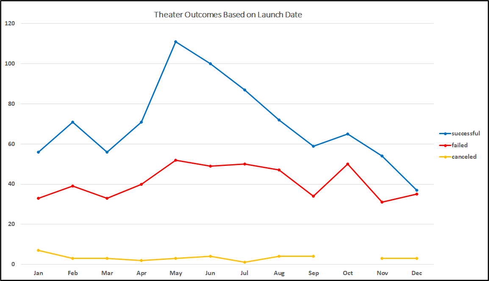
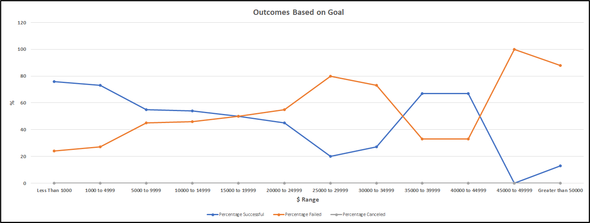

# Kickstarting with Excel

## Overview of Project

### Purpose

The purpose of this project was create an analysis from Kickstarter data to visualize campaign outcomes based on their launch dates and funding goals. Louise's play 'Fever' came close to its fundraising goal and she would like to know how the different campaigns fared in relation to their funding goals and launch dates. Using the Kickstarted data in Excel with descriptive statistics we were able to show some trends in the data.

## Analysis and Challenges

### Analysis of Outcomes Based on Launch Date

A pivot table was created from the Kickstarter worksheet to isolate the each month of the year so that the count of each of the outcomes, successful, failed or canceled could be tallied and graphed. The Parent Category was filtered to show only 'theater' as the criteria. A line chart was created from the pivot table to visualize the relationship between outcomes and launch month. This was an effective way to visually show the trends. See chart below.

### Analysis of Outcomes Based on Goals

A new table was created and a new column with the dollar amount ranges representing the goal for each project. A COUNTIFS function was used to calculate and populate the outcome fields such as successful, failed or canceled. The Subcategory was filtered to show only 'plays' as the criteria. The Sum function was used to populate the totals. The percentages of the successful, failed or canceled outcomes were calculated. A line chart was created to visualize the relationship between the goal amount ranges on the x-axis and percentage of successful, failed or canceled projects on the y-axis. See chart below.

### Challenges and Difficulties Encountered

A challenge that came up was getting the totals to add up in the Outcomes based on Goals table. After debugging the code I found a typo and was able to correct so that everything added up correctly. I also had some challenges with creating the grouping of the Row Labels to show the months of the year. With some trial and error I was able to figure it out and display it properly.

## Results

- The two conclusions that can be drawn about the Outcomes based on Launch Date are:
    - The outcomes of Theater campaigns have a higher success outcome in May and June
    - The outcomes of Theater campaigns have a lower success outcome in December

- What can you conclude about the Outcomes based on Goals?
    - That between the dollar ranges of greater than 0 and less than 5000 have the highest success outcome

- What are some limitations of this dataset?
  - A limitation of this data set could be that we don't know how each of the campaigns was promoted or how many individuals were aware it existed
  - Another limitation is that the city of origin wasn't present in the data which could add an extra element of Analysis

- What are some other possible tables and/or graphs that we could create?
  - I can see value in looking at the 'staff_pick' and 'spotlight' fields and creating a line graph to see what kind of relationship they each have with the outcomes. I would imagine that both of these features could potentially boost the number of eyes that see the campaign.
  
### Links
[Kickstart Challenge Excel Document](Kickstarter_Challenge.xlsx)
